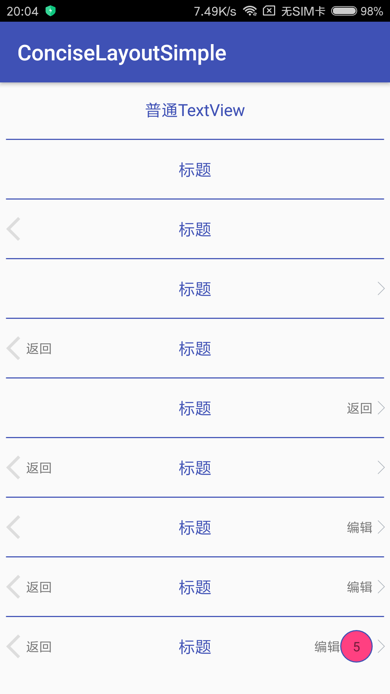

[
# How to
## To get a Git project into your build:
### Step 1. Add the JitPack repository to your build file
### Add it in your root build.gradle at the end of repositories:
``` 
allprojects {
  repositories {
    ...
    maven { url 'https://jitpack.io' }
  }
}
```
### Step 2. Add the dependency
```
dependencies {
  compile 'com.github.deilsky:ConciseLayout:v1.0'
}

```
### Step 3. Used
```
<com.deilsky.conciselayout.ConciseLayout
    android:id="@+id/concise"
    android:layout_width="match_parent"
    android:layout_height="50dp"
    app:center_text="标题"
    app:center_text_color="@color/colorPrimary"
    app:center_text_show="true"
    app:center_text_size="18sp"
    app:icon_left_image="@drawable/ic_back"
    app:icon_left_show="true"
    app:icon_right_image="@drawable/ic_right_icon"
    app:icon_right_show="true"
    app:left_text="返回"
    app:left_text_show="true"
    app:left_text_size="14sp"
    app:point_show="true"
    app:point_size="30dp"
    app:point_text="5"
    app:right_text="编辑"
    app:right_text_show="true" />

ConciseLayout layout = findViewById(R.id.concise);
layout.centerClickable(true)
      .leftClickable(true)
      .rightClickable(true)
      .setOnClickListener(new ConciseLayoutListener() {
          @Override
          public void onLeftClick() {
              Toast.makeText(getApplicationContext(), "左", Toast.LENGTH_SHORT).show();
          }
          @Override
          public void onRightClick() {
              Toast.makeText(getApplicationContext(), "右", Toast.LENGTH_SHORT).show();
          }
          @Override
          public void onCenterClick() {
              Toast.makeText(getApplicationContext(), "中", Toast.LENGTH_SHORT).show();
          }
      });
```
[](https://jitpack.io/#deilsky/ConciseLayout)
